# Blocks Beyond The Stars 🚀

[](https://github.com/marceld23/BlocksBeyondTheStars/stargazers)

⬇️ **[Download & Play](https://github.com/marceld23/BlocksBeyondTheStars/releases/latest)** (latest release — Windows · Linux · experimental macOS)  ·  🌐 [Website](https://www.blocksbeyondthestars.com/en)  ·  ⭐ **[Play on Itch.io](https://jumavegames.itch.io/blocks-beyond-the-stars)**  ·  🎬 [Let's Play](https://youtu.be/43oAgdaT1OE) (German audio)  ·  ⭐ [Star us on GitHub](https://github.com/marceld23/BlocksBeyondTheStars)  ·  🐛 [Report a Bug](CONTRIBUTING.md)

> **An experimental 3D Voxel Space Game, 100% generated by AI, driven by the imagination of a 10-year-old.**

👨‍👩‍👧 **Made for families.** Built by a dad and his 10-year-old and designed to be safe and fun for kids (~8+): no gore, no mature content. Multiplayer chat and the names players choose are kept friendly by our [Code of Conduct](CODE_OF_CONDUCT.md).

⭐ **Like the idea of a 10-year-old's dream game?** Tapping the **Star** button at the top of this page takes one second, makes Justus's day, and helps more families discover Blocks Beyond The Stars. Thank you! 💛

## 📖 The Story: A Next-Gen Family Project

Blocks Beyond the Stars is not a traditional indie game—it is an exploration of what is possible with Generative AI today. It was created by a father and his 10-year-old son:

*   **Justus (10)** is the "Lead Product Manager". He imagines the universe, requests features (from corrupted planets to hover speeders), and acts as the strict lead playtester.
*   **Marcel (Dad)** uses his professional software engineering background to prompt, orchestrate, and integrate those ideas using modern AI tools.
*   **Verena (Mom)** handles the game balancing and tests the multiplayer.

**100% of the assets in this game were created using AI:**
*   **Code & Architecture:** Generated and structured with LLMs.
*   **3D Models, Textures & UI:** Prompted via AI art generators.
*   **Music & Sound Effects:** Synthesized using AI audio tools.
*   **Dynamic Storytelling:** Powered by an optional integrated Python LLM backend (FastAPI + LangChain) for real-time NPC/ship-AI dialogue.

**We'd love your help making this game better!** We made this repository Open Source not just to share our AI workflow, but to build it together with you. Whether you're a developer who wants to dig into the Unity 6 / .NET 8 client/server architecture, an artist, a writer, or simply a player with ideas and bug reports — there's a place for you here. Big features, small fixes, balancing tweaks, fresh ideas: all are welcome. Have a look at **[CONTRIBUTING.md](CONTRIBUTING.md)** to get started, or just press **F1** in-game to send feedback. Let's make it great together. 🚀 And if you're not the coding type — no problem at all: a single ⭐ is the easiest way to cheer Justus on and help us grow.

## 🪐 What is it? (The Short Pitch)

A block-based 3D space crafting game for Windows and Linux (with an experimental macOS build), built from day one as a persistent client/server multiplayer experience.

You wake aboard your own spaceship. Out there are procedurally generated star systems—each with its own sun, planets, moons, and asteroid fields. Land on unique worlds (from airless rocks to lava fields and floating skylands), mine resources, craft gear, and unlock blueprints.

Design your ship block by block, fly real system-scale routes, dock at space stations, tame alien creatures, and build your own planet bases with your friends.

## 🎮 Features at a Glance

*   **System-Scale Flight:** Fly between unique procedurally generated planets and jump between star systems.
*   **Complete Freedom:** Every block can be mined, reshaped, and rebuilt.
*   **Deep Crafting:** Mine, smelt, unlock blueprints, and craft everything from hover speeders to space stations.
*   **Explore & Claim:** Discover rare factories with their own production terminals, salvage fallen ruins and treasure chests — and claim a factory as your own base with a rare access code.
*   **In-Game Editors:** Design your own ships, stations, and cities block by block.
*   **Rich Multiplayer:** Form alliances, share bases, and communicate via global radio.
*   **The VEGA Protocol:** An optional story campaign narrated by your ship's AI companion.
*   **Windows & Linux:** Native desktop clients — no Wine/Proton needed (an experimental macOS build exists too).

## 🎬 Watch the Let's Play

See the game in action — Justus's very first playthrough (German audio):

<a href="https://youtu.be/43oAgdaT1OE"></a>

More on our YouTube channel:

*   ▶️ [Let's Play & Tutorials playlist](https://www.youtube.com/playlist?list=PL2xTr_0UowpDXvcDWL7ZDp_Z8iXMo5KGk)
*   📱 [Shorts playlist](https://www.youtube.com/playlist?list=PL2xTr_0UowpBt2mFd3wcRf43z39lRCEGH)

👍 Liking the videos already helps a lot to make the game better known — and a ⭐ here on GitHub helps even more to grow our community!

## Screenshots

<table>
  <tr>
    <td width="50%">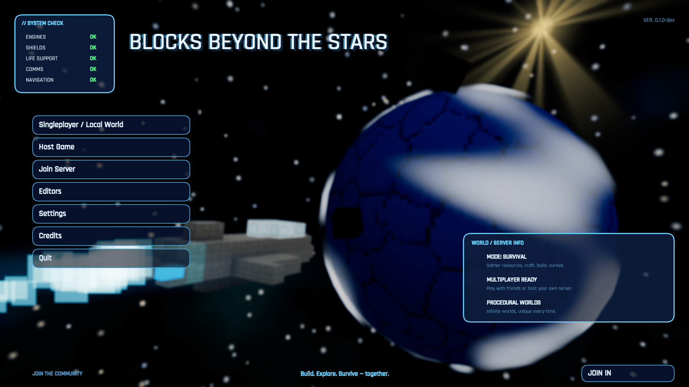<br><sub>Main menu</sub></td>
    <td width="50%">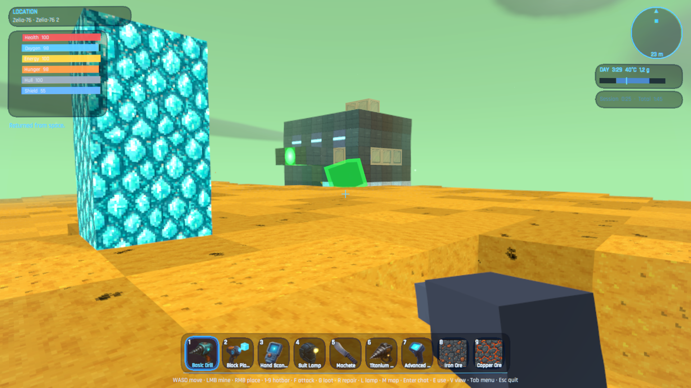<br><sub>On a planet surface</sub></td>
  </tr>
  <tr>
    <td width="50%">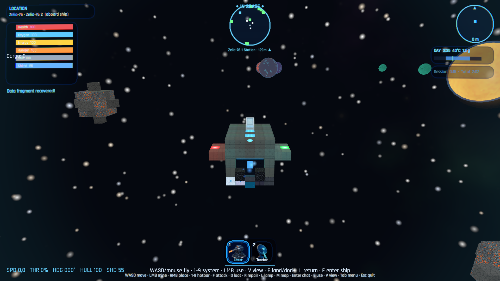<br><sub>Space flight between worlds</sub></td>
    <td width="50%">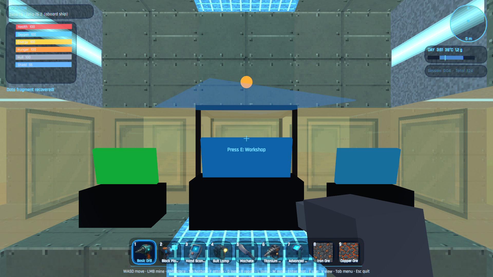<br><sub>The ship cockpit</sub></td>
  </tr>
  <tr>
    <td width="50%">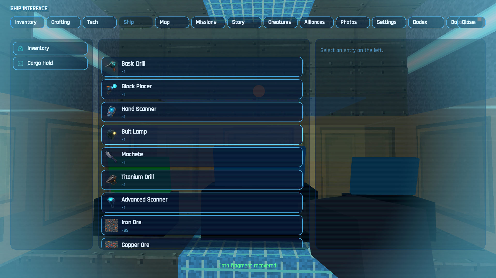<br><sub>The in-game menu (crafting, tech, ship, map…)</sub></td>
    <td width="50%"></td>
  </tr>
</table>

**Many different worlds** — every planet type has its own terrain, flora and sky:

<table>
  <tr>
    <td width="25%">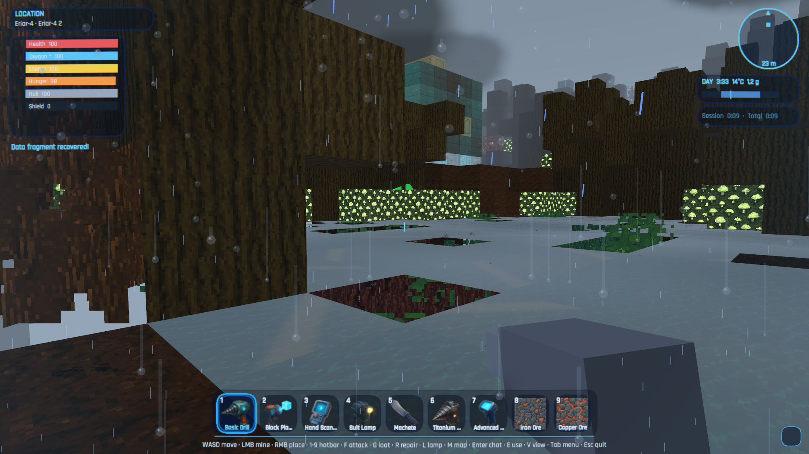<br><sub>Jungle</sub></td>
    <td width="25%">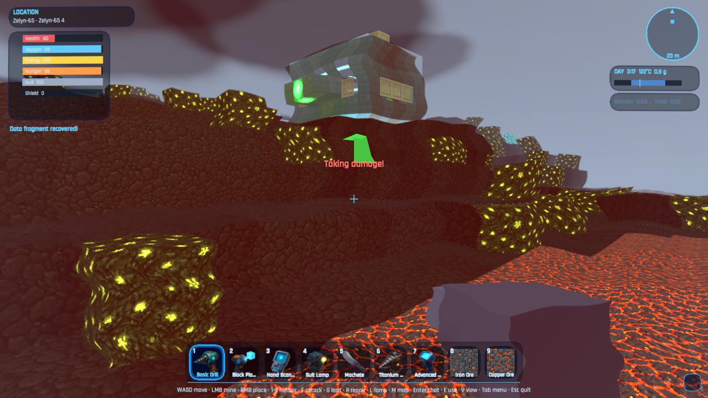<br><sub>Lava</sub></td>
    <td width="25%">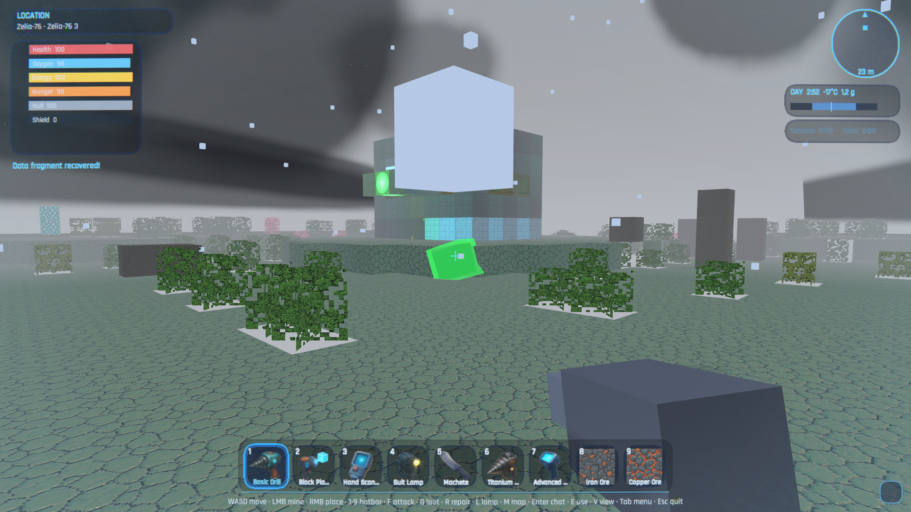<br><sub>Ice</sub></td>
    <td width="25%">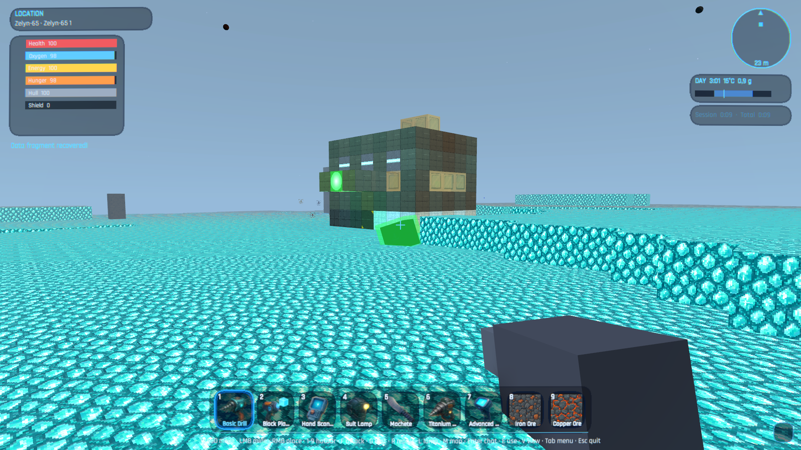<br><sub>Crystal</sub></td>
  </tr>
  <tr>
    <td width="25%">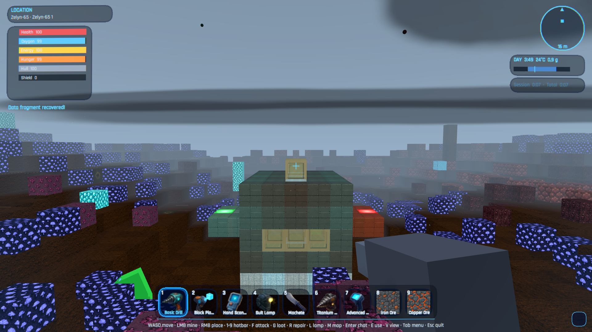<br><sub>Fungal</sub></td>
    <td width="25%">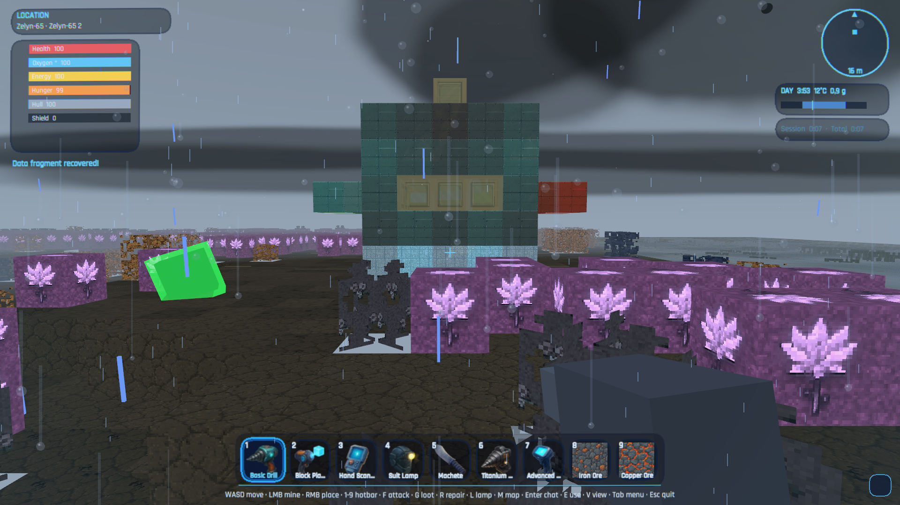<br><sub>Skylands</sub></td>
    <td width="25%">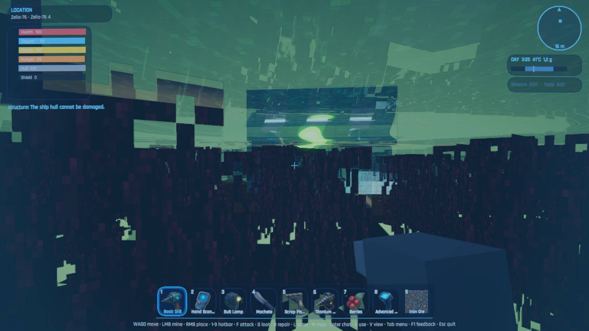<br><sub>Ocean</sub></td>
    <td width="25%"></td>
  </tr>
</table>

<sub>Generated from the live game — see [docs/screenshots/](docs/screenshots/README.md).</sub>

## About this project

**Blocks Beyond the Stars — JuMaVe Games** — a family project by Justus, Marcel and Verena Dütscher (see [The Story](#-the-story-a-next-gen-family-project) above).

We're hoping for community support! Get involved and join in — your name could soon be here too!
See **[CONTRIBUTING.md](CONTRIBUTING.md)** for how to play, report bugs, or send a pull request,
and our short **[Code of Conduct](CODE_OF_CONDUCT.md)** (the gist: be kind to one another).

*(This is the same credit shown in the game's Credits screen — `ui.credits.body`.)*

### Contributors

Community contributions we're grateful for:

- **Cora de la Mouche** ([@corarona](https://github.com/corarona)) — Linux support: client build target, console launcher, bash build scripts and cross-platform release CI/CD ([#69](https://github.com/marceld23/BlocksBeyondTheStars/pull/69))
- **Maqbool Ahmed** ([@Maqbool61](https://github.com/Maqbool61)) — German localization: removed duplicate keys and fixed awkward wording in `de.json` ([#112](https://github.com/marceld23/BlocksBeyondTheStars/pull/112))

Want to see your name here? See **[CONTRIBUTING.md](CONTRIBUTING.md)**.

> **Status & docs:** [TODO.md](TODO.md) is the single Done/Open status doc; player operation is in
> [docs/user/USER_MANUAL.md](docs/user/USER_MANUAL.md); building and verifying builds is in
> [docs/developer/DEVELOPER.md](docs/developer/DEVELOPER.md); the system overview is in
> [docs/developer/ARCHITECTURE.md](docs/developer/ARCHITECTURE.md) and every developer doc is indexed in
> [docs/developer/README.md](docs/developer/README.md). (The original German requirement specs under `plans/`
> were consolidated and removed.)
> Docs and code comments are **English**. In-game text is **bilingual (German + English)**.

## Project Status

Blocks Beyond the Stars is a free in-development game. Bugs, missing content and compatibility issues are expected. Multiplayer and server behavior may change between versions.

The software is provided as-is under the terms of the [license](#-license) included in this repository.

## System requirements

The **game client ships as a Windows build** (with a **native Linux build** and an **experimental
macOS build** also available), but the **server is cross-platform** — so a Linux/macOS machine, a
NAS or a VPS (including via Docker) can host a world that players join.

**Game client (to play)**

- **Windows 10/11 (64-bit).** A GPU with DirectX 11+ support (Unity 6 / URP) and a few GB of free
  disk for the client + worlds.
- **Linux (native):** a native `StandaloneLinux64` build is available. Launch it from the terminal
  via `./BlocksBeyondTheStars.x86_64` or through the console launcher (`./BlocksBeyondTheStars.Launcher.Console`).
- **Linux (Proton/Wine):** the Windows build also runs through **[Proton](https://github.com/ValveSoftware/Proton)**
  (Steam Play) or **Wine**. If the native build has issues on your distro, try the Windows build via Proton.
  If it feels sluggish, open **Settings → Graphics** and **turn VSync off** (optionally set a frame-rate
  limit), lower the **quality preset** (Potato/Low also disables the costlier screen-space effects)
  and the **view distance**. A recent Proton (e.g. Proton GE) generally gives the smoothest result.
- **macOS (experimental):** a `StandaloneOSX` `.app` bundle (Intel x64; runs on Apple Silicon via
  Rosetta 2) is published as `…-osx-…-Portable.zip`. It is **unsigned and un-notarized**, so macOS
  Gatekeeper quarantines it — see the [macOS security notice](#macos-security-notice) below. Consider
  it a preview: it builds green in CI but has had limited hands-on testing.
- The client always talks to a server: a local one started automatically in singleplayer / "Host
  Game", or a remote dedicated server.

**Dedicated server (to host)**

- **OS-independent.** Self-contained packages (no .NET install needed) ship for **Windows x64,
  Linux x64 and Linux ARM64**; build them with `scripts/publish-server.ps1` / `.sh`.
- Or run the **Docker image** on any Docker host — Linux, macOS, Windows (Docker Desktop / WSL2), a
  NAS or a VPS. Pull it from GHCR (`ghcr.io/marceld23/blocks-beyond-the-stars-server`) or build it
  locally. See [SELF_HOSTING.md §10](docs/developer/SELF_HOSTING.md#10-running-in-docker).
- Lightweight: **no GPU**, modest CPU/RAM. On low-power ARM64 boards prefer an SSD over a
  microSD/eMMC for the world database.
- From source you only need the **.NET 8 SDK** (see [Build, test, run](#build-test-run)).

## Windows security notice

This Windows build is **currently not digitally signed**. Because of that, Windows 11 /
Microsoft Defender SmartScreen may show a warning such as *"Windows protected your PC"* the
first time you start the game.

If you downloaded the game from this GitHub page (or from the
[official releases](https://github.com/marceld23/BlocksBeyondTheStars/releases)) and trust the
source, you can choose **"More info"** and then **"Run anyway"** to start it. If you do not trust
the download source, do not run the game.

Blocks Beyond the Stars uses a local/server-based multiplayer architecture. On first launch,
**Windows Defender Firewall** may ask for permission more than once — for example for the game
client and for the local/server component. To play, host, or connect to multiplayer sessions, you
may need to allow these components through the firewall.

- **Recommended:** allow access for **private networks only**, unless you know you need public
  network access.
- Please **do not disable your firewall**.

## macOS security notice

The macOS build is **experimental** and **not code-signed or notarized**. macOS Gatekeeper will
therefore quarantine the downloaded `.app` and refuse to open it on a double-click. If you trust the
[official releases](https://github.com/marceld23/BlocksBeyondTheStars/releases), there are two ways
to run it after unzipping:

- **Right-click the app → "Open"**, then confirm **"Open"** in the dialog (only needed once), or
- clear the quarantine flag from a terminal:

  ```bash
  xattr -dr com.apple.quarantine "BlocksBeyondTheStars.app"
  ```

The bundle is **Intel x64**; on Apple Silicon (M-series) it runs through Rosetta 2. Singleplayer
launches a bundled local server inside the app the same way the Windows/Linux builds do. As with the
other platforms, macOS may ask you to allow the game/server through the firewall on first launch —
allowing **private networks only** is recommended.

## Guiding principle

> **The Unity client is presentation and input. The .NET server is the truth of the game world.**

The client sends *intents*; the server validates them authoritatively and broadcasts the
resulting *state*. The client never decides resources, inventory, crafting, ship state,
oxygen, damage, blueprints or travel.

## Tech stack

| Area | Choice |
|---|---|
| Client | Unity 6 LTS (6000.4.x), URP + C# (Windows, Linux, experimental macOS) — see [`client/`](client/) |
| Server | .NET 8, standalone console host (no Unity runtime) |
| Admin UI | ASP.NET Core 8 minimal API + HTML dashboard |
| Database | SQLite (default, portable); optional PostgreSQL for hosted realms |
| Realtime net | LiteNetLib UDP + MessagePack for native clients; WebSocket + JSON envelope for WebGL |
| Shared logic | `netstandard2.1` so the same code runs in Unity *and* the server |

## Repository layout

```
src/BlocksBeyondTheStars.Shared/          data models, data-driven definitions, localization, protocol DTOs
src/BlocksBeyondTheStars.WorldGeneration/ seed-based deterministic chunk generation
src/BlocksBeyondTheStars.Persistence/     SQLite/PostgreSQL repositories, savegame layout, autosave, backups
src/BlocksBeyondTheStars.Networking/      transport abstraction (LiteNetLib + WebSocket + loopback), messages, codec
src/BlocksBeyondTheStars.GameServer/      authoritative tick loop + console host
src/BlocksBeyondTheStars.Api/             admin web UI + API
src/BlocksBeyondTheStars.Tools/           validate/info/backup CLI
src/BlocksBeyondTheStars.Client.Core/     Unity-free client logic (NetworkClient, ClientWorld), netstandard2.1
src/BlocksBeyondTheStars.Launcher/        Windows-only WinForms loading-splash launcher (net8.0-windows)
src/BlocksBeyondTheStars.Launcher.Console/Cross-platform console launcher for Linux (net8.0, SkiaSharp splash)
tests/BlocksBeyondTheStars.Tests/         xUnit tests (server/shared)
tests/BlocksBeyondTheStars.Client.Tests/  headless client<->server integration tests
client/                         Unity project (scripts + scaffold + Assets/Tests; open in the Unity Editor)
ai-backend/                     optional Python LLM service (mission/NPC/ship-AI text) — game runs without it
tools/                          editor-export merge tools (Python) + AI asset generation (tools/ai-assets)
data/                           data-driven content (blocks, items, recipes, blueprints, modules, planets)
data/locales/                   localization (en.json, de.json)
docs/user/                      player-facing manual (USER_MANUAL.md)
docs/developer/                 architecture, design/how-it-works docs, ADRs (docs/developer/adr/) — see its README.md index
scripts/                        build-client.ps1 (Windows) + build-client.sh (Linux) + publish scripts
```

## Build, test, run

Requires the **.NET 8 SDK**.

```powershell
dotnet build BlocksBeyondTheStars.CI.slnf  # build everything (Linux: use .slnf to skip WinForms launcher)
dotnet test                       # run all .NET tests (server/shared + headless client<->server)
./scripts/run-tests.ps1           # selectable test runner (Windows); ./scripts/run-tests.sh on Linux
dotnet run --project src/BlocksBeyondTheStars.GameServer   # start a local dedicated server (UDP 31415)
dotnet run --project src/BlocksBeyondTheStars.Api          # start the admin UI (http://127.0.0.1:31416)
```

```bash
dotnet build BlocksBeyondTheStars.CI.slnf  # build everything (skips WinForms launcher)
./scripts/run-tests.sh                     # selectable .NET test runner (suites: Dotnet, ClientCore, All)
dotnet run --project src/BlocksBeyondTheStars.GameServer   # start a local dedicated server
```

The playable client is built with `scripts/build-client.ps1` (Windows) or `scripts/build-client.sh`
(Linux) — these publish the shared libs + bundled server and run a Unity batch build (requires the
Unity Editor). See [docs/developer/DEVELOPER.md](docs/developer/DEVELOPER.md) for the full build guide,
how to verify a build is fresh, and known build pitfalls. The Unity client is tested against the
**real** game server — the approach is documented in
[docs/developer/CLIENT_TESTING.md](docs/developer/CLIENT_TESTING.md).

Server configuration lives in `config/server.json` (created on first run) and is editable
via the admin UI. See [docs/developer/SELF_HOSTING.md](docs/developer/SELF_HOSTING.md).

### Admin dashboard

`BlocksBeyondTheStars.Api` is a standalone web host serving the server admin dashboard at
**`http://127.0.0.1:31416/`** (`adminBindAddress`/`adminPort` in `config/server.json`):
status, config editing, backups, log tail and mission/content tools — optionally gated by
an admin password. Start it with `dotnet run --project src/BlocksBeyondTheStars.Api`, or in a
server package run `BlocksBeyondTheStars.Api(.exe)` from the install folder (next to the game
server, so both share `config/server.json`). URL, auth and the full HTTP API are documented
in [docs/developer/SELF_HOSTING.md](docs/developer/SELF_HOSTING.md) §5.

### Tools CLI

```powershell
dotnet run --project src/BlocksBeyondTheStars.Tools -- validate data
dotnet run --project src/BlocksBeyondTheStars.Tools -- info saves world_001
dotnet run --project src/BlocksBeyondTheStars.Tools -- backup saves world_001
```

### Optional AI backend (LLM)

[`ai-backend/`](ai-backend/) is a separate, optional Python service (FastAPI + LangChain/LangGraph,
provider-agnostic via the OpenAI-compatible chat API — LM Studio / OpenAI / Claude, chosen by env)
that writes mission texts and NPC/ship-AI dialogue. The game is fully playable without it — every
AI text has a scripted, localized fallback, and the C# server validates everything the service
returns. It is also **bundled into the Docker image** and starts automatically when you mount its
`.env` (otherwise no Python process runs). See [ai-backend/README.md](ai-backend/README.md),
[docs/developer/AI_MISSION_BACKEND.md](docs/developer/AI_MISSION_BACKEND.md) and
[SELF_HOSTING.md §10](docs/developer/SELF_HOSTING.md#10-running-in-docker).

### Self-hosting packages

```powershell
./scripts/publish-server.ps1            # win-x64, linux-x64, linux-arm64
```
Produces self-contained, single-file packages (no .NET install needed on the host) under
`artifacts/`. On Linux/macOS use `scripts/publish-server.sh`.

You can also run the server (game server + admin/portal/download UI, plus the optional bundled AI text
backend) as a **Docker container** on any OS. Each tagged release publishes a multi-arch image to GHCR,
so you can just pull it — `docker pull ghcr.io/marceld23/blocks-beyond-the-stars-server:latest` — or
build it locally with `docker compose up -d`. The self-hosting guide has the full setup plus a
step-by-step **local test in Docker Desktop**:
[docs/developer/SELF_HOSTING.md §10](docs/developer/SELF_HOSTING.md#10-running-in-docker)
([try it locally](docs/developer/SELF_HOSTING.md#try-it-locally-docker-desktop)).

Players can also download and install the Windows client **from the running server's own web page**:
`scripts/publish-client-installer.ps1` builds a [Velopack](https://velopack.io) installer + auto-update
feed, the admin host serves it at `/download` + `/updates`, and the `/portal` page links it. See
[docs/developer/SELF_HOSTING.md](docs/developer/SELF_HOSTING.md) §9.

## Adding content (data-driven)

Blocks, items, recipes, blueprints, ship modules and planets are JSON in `data/`; no code
changes are needed to add content. Player-facing names use localization keys resolved from
`data/locales/{en,de}.json`. Validate with `BlocksBeyondTheStars.Tools validate`.

## Status

A fully playable client + server game: **multiple star systems** (each with its own sun, planets,
moons and asteroid fields), procedurally generated worlds that wrap east–west (walk around the
planet, seam-free), 18 planet types including exotic ones (skylands, fungal, corrupted, ocean,
salt flats, …) with their own flora and fauna, swimming/diving, creature taming, a craftable hover
speeder, mining → crafting → blueprints →
ship building, real system-scale space flight (with jumps between systems) with stations,
settlements and NPCs, peaceful NPC trader traffic, rare **factories** with roster-limited
production terminals, fallen **ruins** and **treasure chests**, **access-code claiming** that
turns a factory into your own editable base, the
**"VEGA Protocol" story campaign** (a swappable, story-agnostic engine with lore fragments, three
Guardian machine types and a two-route finale), multiplayer with per-player ships, **player
alliances**, shared bases and trading, planet **bases + teleporter pads**, material dyeing and
colored-light building, in-game customization (avatar pixel-face editor, content/ship/station
editors), an in-game **Codex wiki + data-cube arcade minigames**, a built-in **music library**,
the VEGA ship-AI onboarding/advisor companion, world-creation options, and an optional LLM backend
for dynamic dialogue/mission text. Self-hostable dedicated server. **Native Windows and Linux**
clients (no Wine/Proton; an experimental macOS build exists), and **opt-in automatic crash reporting**
so problems get fixed faster.
Currently **875 xUnit tests pass** (779 server/shared + 96 headless client<->server).

See [TODO.md](TODO.md) for the current Done/Open status, the
[user manual](docs/user/USER_MANUAL.md) for controls/mechanics/commands, and [AGENTS.md](AGENTS.md)
for contributor rules.

## 📜 License

Blocks Beyond the Stars is **free and open-source software**, licensed under the
**[GNU Affero General Public License v3.0 or later](LICENSE)** (AGPL-3.0-or-later).
You may run, study, share and modify it; if you run a modified version for others over a
network, the AGPL requires you to offer them its source code.

**Source code:** [github.com/marceld23/BlocksBeyondTheStars](https://github.com/marceld23/BlocksBeyondTheStars)
— the canonical repository for the corresponding source, wherever you obtained this build.

Third-party libraries and bundled assets keep their own (permissive) licenses — see
[NOTICES.md](NOTICES.md).

**Our promise to the community:** we guarantee the GitHub version always stays free,
AGPL-licensed and current. We (the founders) may additionally license the code commercially
**only** for closed console networks (e.g. Steam / Xbox / console certification), which cannot
ship a pure AGPL build — never to take the open version away. This is why code contributions are
made under a Contributor License Agreement; see **[CONTRIBUTING.md](CONTRIBUTING.md)**.
