# Marketing screenshots

Automatically generated in-game screenshots for the website / marketing material, captured
straight from the real game at **1920×1080** (PNG), once per language.

```
docs/screenshots/
├── de/   ← German HUD
└── en/   ← English HUD
```

## The shots

Gallery shows the English set (`en/`); a matching German set lives in `de/`.

<table>
  <tr>
    <td width="50%">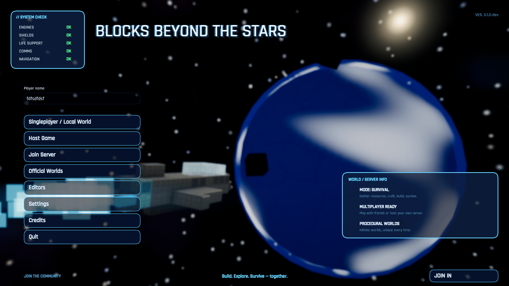<br><sub><b>start_screen.png</b> — Main menu (title, planet, ship, nebula)</sub></td>
    <td width="50%">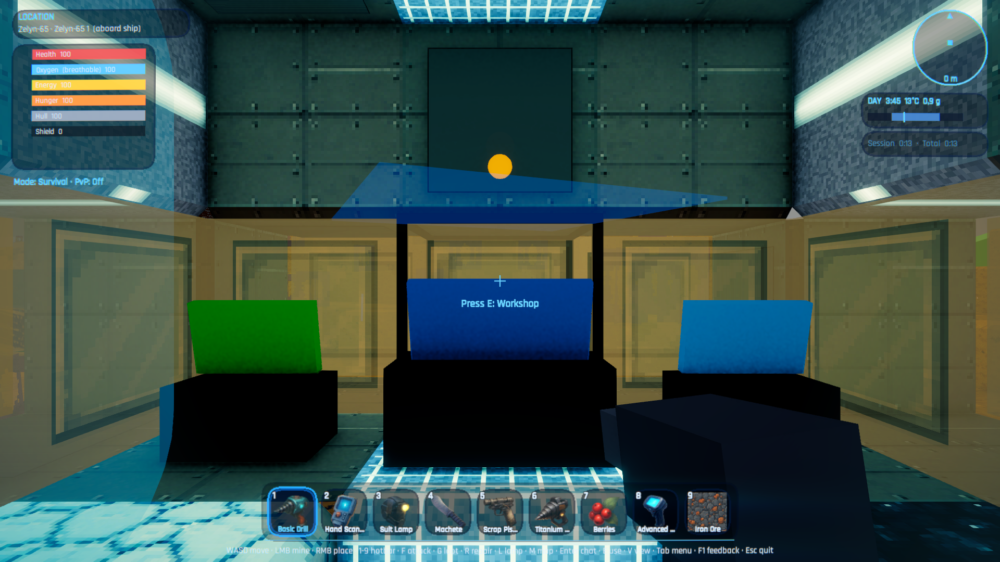<br><sub><b>cockpit_hud.png</b> — The ship cockpit with the in-game HUD</sub></td>
  </tr>
  <tr>
    <td width="50%">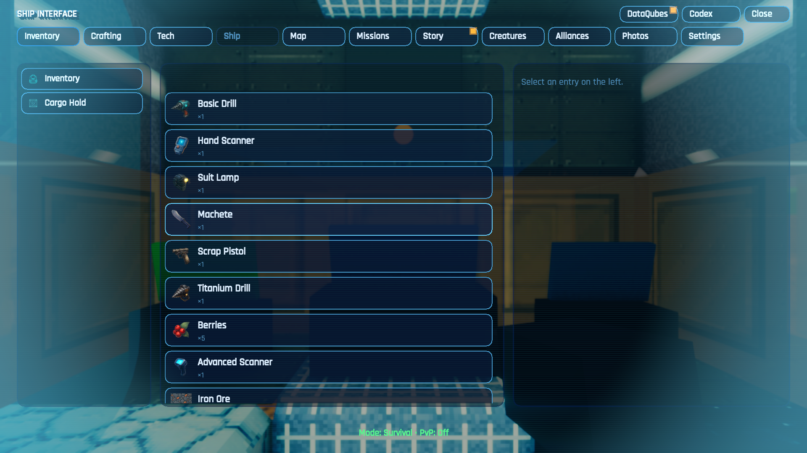<br><sub><b>cockpit_menu.png</b> — The in-game Tab menu open over the cockpit</sub></td>
    <td width="50%">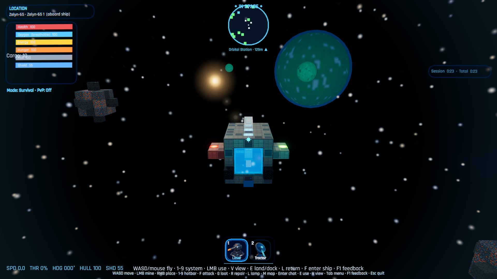<br><sub><b>space_flight.png</b> — Space flight: ship + flight HUD, asteroids and a planet behind</sub></td>
  </tr>
  <tr>
    <td width="50%">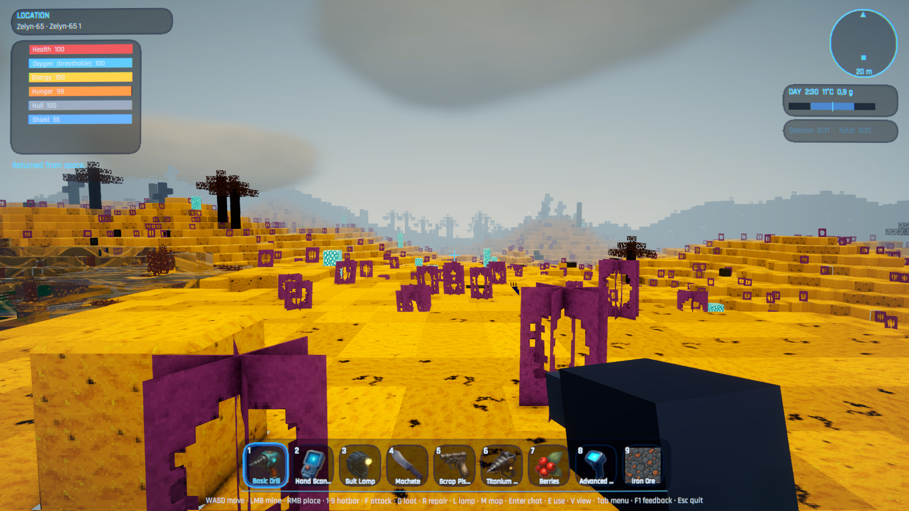<br><sub><b>planet_surface.png</b> — Player view on a planet surface, looking out over the terrain</sub></td>
    <td width="50%"></td>
  </tr>
</table>

### Planet variety — one surface per planet type

`surface_<key>.png` shows the player's view on a different planet **type**, to showcase the world
variety. Each is a separate run that spawns a fresh world pinned to that type
(`capture-screenshots.ps1 -Planets`, see below).

<table>
  <tr>
    <td width="50%">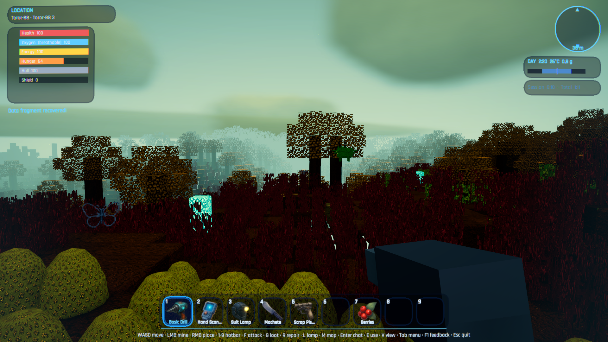<br><sub><b>surface_jungle.png</b> — Lush jungle world</sub></td>
    <td width="50%">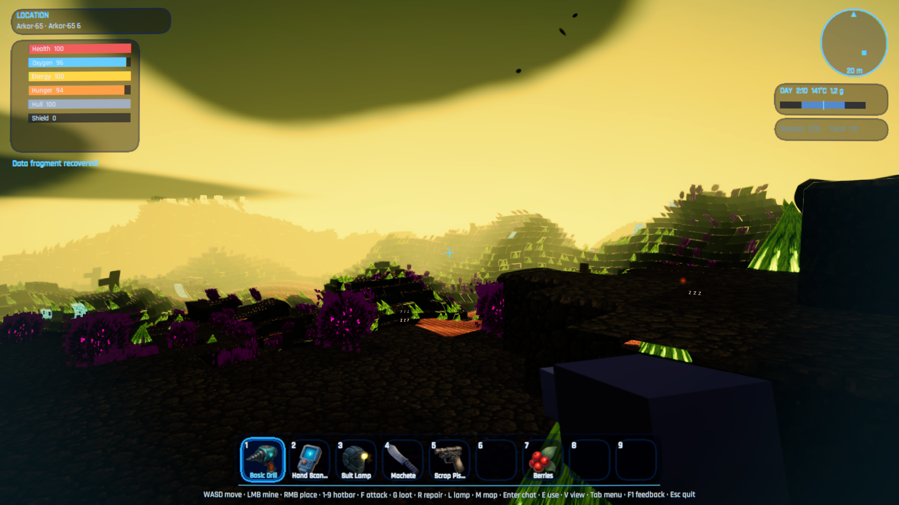<br><sub><b>surface_lava.png</b> — Volcanic lava world</sub></td>
  </tr>
  <tr>
    <td width="50%">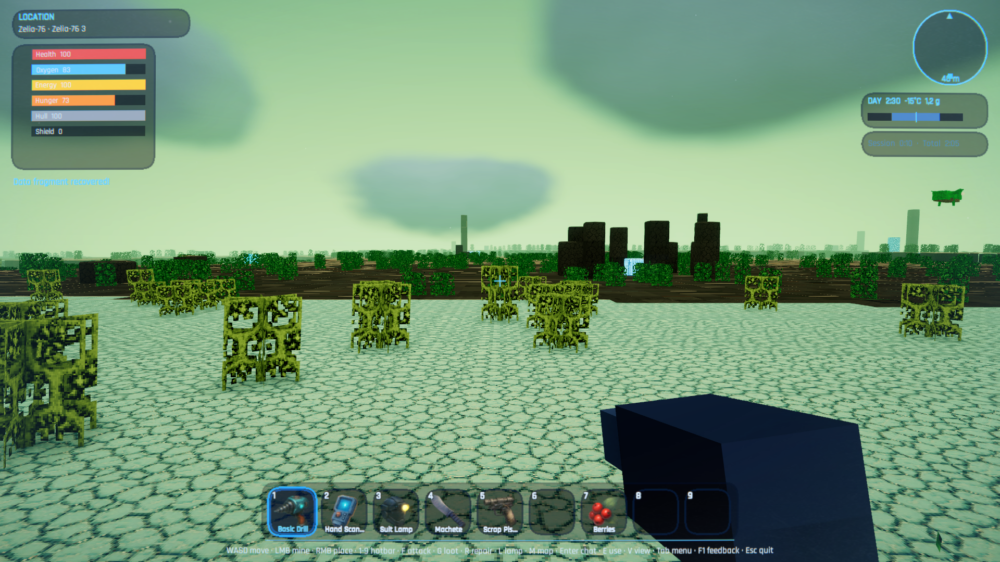<br><sub><b>surface_ice.png</b> — Frozen tundra world</sub></td>
    <td width="50%">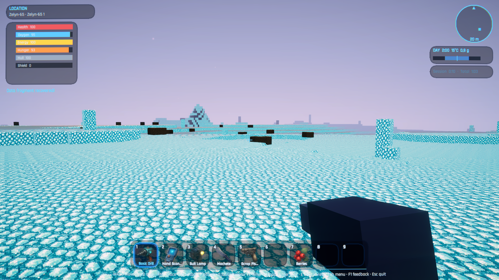<br><sub><b>surface_crystal.png</b> — Crystalline world</sub></td>
  </tr>
  <tr>
    <td width="50%">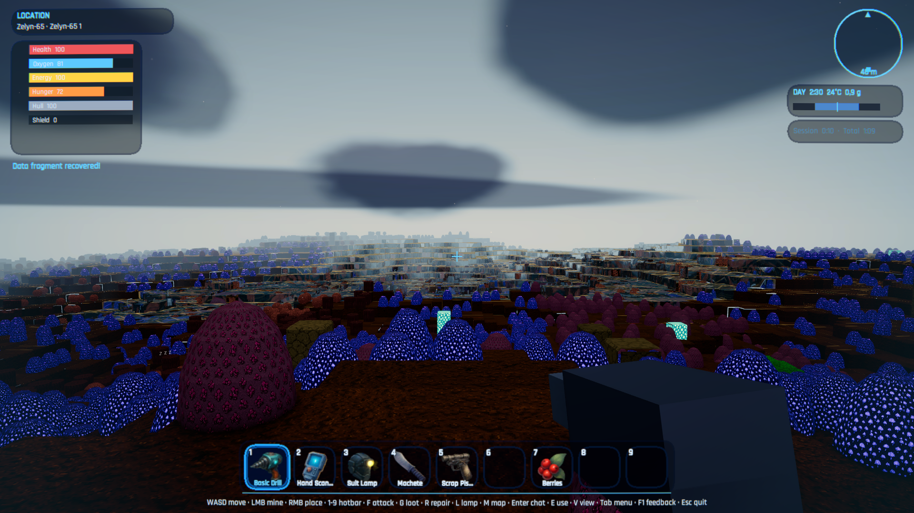<br><sub><b>surface_fungal.png</b> — Fungal world (glowing mycelium)</sub></td>
    <td width="50%">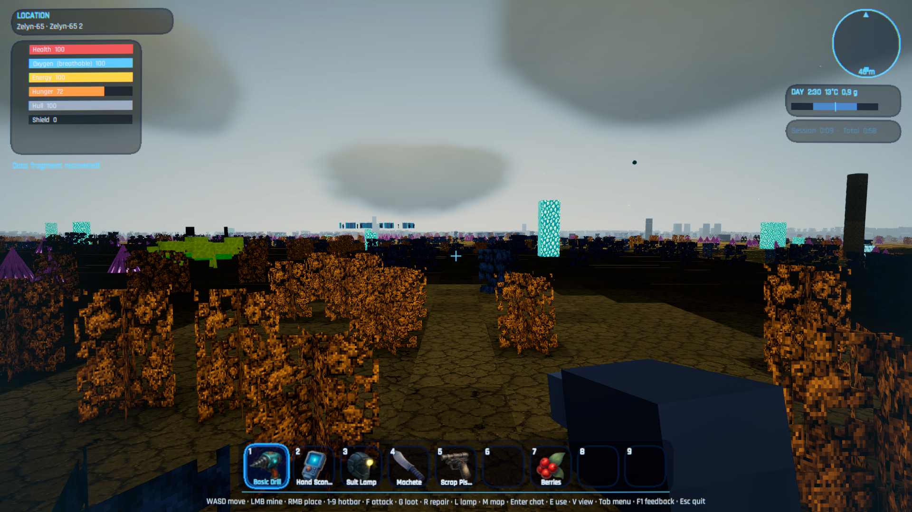<br><sub><b>surface_skylands.png</b> — Floating skylands world</sub></td>
  </tr>
  <tr>
    <td width="50%">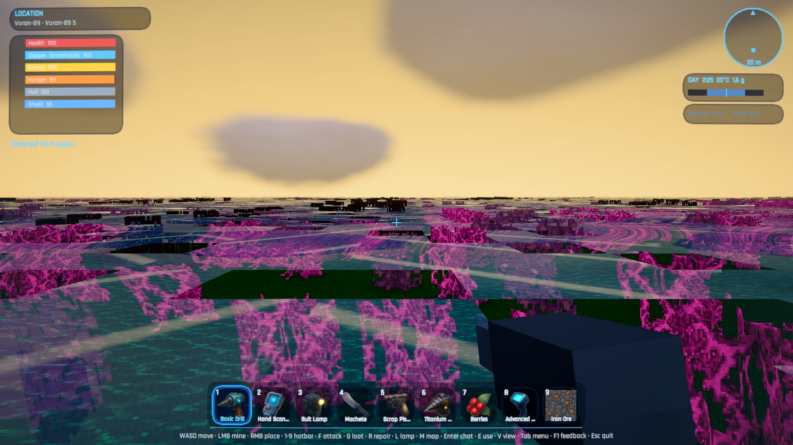<br><sub><b>surface_ocean.png</b> — Ocean world (algae mats over shallow water)</sub></td>
    <td width="50%">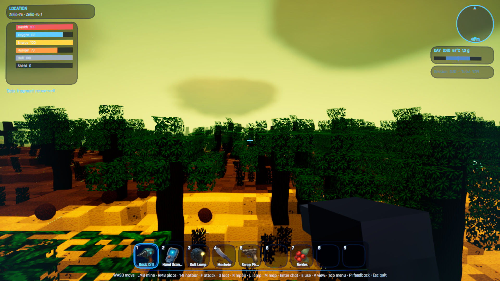<br><sub><b>surface_desert.png</b> — Arid/forested world</sub></td>
  </tr>
</table>

> **Placement** is terrain-aware (`PlayerController.PlaceForCaptureNear`): the director probes a ring
> of spots around the landed ship and only stands on a SOLID, DRY one with OPEN SKY above and NOT
> boxed in by walls (the enclosure check — the ship's glass skylight lets the plain open-sky ray pass
> even *inside* the hull), then waits until the player is grounded, alive and not submerged before the
> shot — otherwise it skips that type rather than writing a broken frame. The player stands well back
> from the ship and faces AWAY from it, so each shot shows the planet's landscape (the ship stays
> behind the camera). On water-dominated **ocean** worlds no dry footing may exist near the ship — the
> run then skips the shot and keeps the previous PNG.

## How to regenerate

The shots are produced by **running the built game player** with a `-captureShots` flag. A
self-installing in-game director then drives the client through the scene sequence and writes
each PNG. One run per language (the HUD language is fixed when the world starts), handled by the
wrapper script.

```powershell
# 1) Build the Windows player (bundles the local server that singleplayer needs)
./scripts/build-client.ps1

# 2) Capture both languages → docs/screenshots/de and /en
./scripts/capture-screenshots.ps1

# Build + capture in one go:
./scripts/capture-screenshots.ps1 -Build

# Single language / custom world seed / custom output:
./scripts/capture-screenshots.ps1 -Lang de
./scripts/capture-screenshots.ps1 -Seed 424242 -OutRoot ./docs/screenshots

# Lava uses a hand-picked seed (see below) — after deleting its save, regenerate it with:
./scripts/capture-screenshots.ps1 -SkipMain -Planets lava -Seed 2468
```

**Requirements:** the project's Unity editor (6000.6.x) for the build, and a machine with a GPU — the
capture renders real frames, so it is *not* a headless `-nographics` run.

## How it works (for maintainers)

| Piece | File | Role |
|-------|------|------|
| Director | [`client/Assets/BlocksBeyondTheStars/Scripts/ScreenshotDirector.cs`](../../client/Assets/BlocksBeyondTheStars/Scripts/ScreenshotDirector.cs) | Self-installs when `-captureShots` is on the command line; drives the sequence and writes the PNGs (`ScreenCapture.CaptureScreenshotAsTexture`, full frame incl. HUD) |
| Editor menu | [`client/Assets/BlocksBeyondTheStars/Editor/CaptureMenu.cs`](../../client/Assets/BlocksBeyondTheStars/Editor/CaptureMenu.cs) | *BlocksBeyondTheStars → Capture Screenshots → Run (German/English)* for a quick in-editor run (set the Game view to 1920×1080 for exact size) |
| Wrapper | [`scripts/capture-screenshots.ps1`](../../scripts/capture-screenshots.ps1) | Runs the player exe once per language with the right flags |

**Sequence the director runs:** main menu → cockpit HUD → open the Tab menu (cockpit menu) →
take off to space flight → land back and step out onto the planet surface.

Most of this uses ordinary gameplay intents (no cheats). Three tiny **capture hooks** were added
because some state can't be reached without input during an unattended run:

- `SpaceView.SetFlightYaw(float)` — choose the flight heading (`FlightHeading` constant in the director).
- `PlayerController.SetCapturePose(Vector3, yaw, pitch)` — step the on-foot player out of the ship onto open terrain.
- `GameMenu.SetMenuOpen(bool)` — open/close the Tab menu exactly as the Tab key does.

**Determinism:** a fixed world (`MarketingShots`) + a fixed seed (`-seed`, default `424242`) make
every run reproducible, so the set can be regenerated after any game change.

**Capture worlds are Sandbox/Creative worlds** (`sandbox: true` in the director): planet enemies,
bandit turrets and the temperature hazard all gate on Survival, so nothing can shoot the player or
burn "Taking damage!" into a frame — while the HUD (vitals, minimap, hotbar) looks the same as in
Survival. Direct lava CONTACT damage is unconditional even in Sandbox, which is one reason the lava
seed is hand-picked (see below).

One planet surface uses a hand-picked seed because the default seed framed it badly (lava: the
placement ring found footing amid a lava ocean → contact damage in frame, or a dark no-lava scene):
**lava = `-Seed 2468`** (visible lava river, dry basalt footing). The older hand-picked jungle/ocean
seeds (133742/555555) predate the continents worldgen and no longer produce a usable placement —
both types now use the default seed.
Note that the per-planet worlds are persisted saves (`singleplayer-saves/MarketingShots_<type>`) — a
re-run reuses the existing world and ignores `-seed`; delete the save to regenerate from a new seed.
Beware when only ONE language of a per-planet shot needs a re-shoot: a reused save resumes the player
on foot where the last run left them (#401), and a wandering/sleeping creature can end up blocking the
new placement — delete the save so the world regenerates fresh (same seed ⇒ same world).
The MAIN-sequence world (`MarketingShots`) is deleted automatically by the wrapper before each run:
since #401 a quit saves the live player position, so a reused save would resume the player on foot
outside the ship, breaking the cockpit shots and the take-off. Before every shot the director
dismisses VEGA's intro lines (`VegaPanel.DismissSpeechForCapture`) and clears the single-line HUD
toast (`GameBootstrap.ShowMessage("")` + a 0.25 s settle — HudUi only copies the message to the label
on its 10 Hz refresh), so lingering notices ("Data fragment recovered!", the mode line, space-return
messages) never land in a frame.

### Tuning

The wait timings and the flight heading are constants at the top of `ScreenshotDirector.cs`
(`MenuSettle`, `ChunkSettle`, `PoseSettle`, `FlightHeading`, `DefaultSeed`). Adjust them if a shot
is mis-timed or you want a different framing, then rebuild and re-run.

## Video clips (`-captureClip`) — and look checks without a playtest

The moving-picture sibling is `ClipDirector` (`-captureClip`): one run records ONE clip from a JSON
manifest (`-clipManifest <path> -clipName <name>`, default manifest `marketing/clips/clips.json`) as a
PNG frame sequence plus a frame-synced WAV; `scripts/capture-clips.ps1` loops the player over every
clip and muxes MP4s with FFmpeg. Each `ClipSpec` (see `ClipManifest.cs`) picks the scene
(`space` / `surface` / `cockpit` / `land` / `intro`), HUD on/off, length, fps, a camera move
(`static` / `yaw_sweep` / `orbit` / `dolly` / `pan`) and diegetic motion (ship throttle, walking, look).

Since #2405 a clip can also pin the **environment** and the **pose**, which is how a shader or lighting
change is verified without playing — same seed before and after, Low and High:

| Field | Values | Meaning |
|-------|--------|---------|
| `timeOfDay` | `0..1` (`0` midnight, `0.27` dawn, `0.5` noon, `0.75` dusk); negative = off | Local time of day pinned for the clip (longitude-compensated, like the screenshot pin) |
| `weather` | a state (`clear`, `clouds`, `rain`, `storm`, `fog`, `ground_fog`, `blizzard`, `gale`, …) or a precipitation form (`snow`, `sleet`, `hail`, `sandstorm`, `dust`, `ash`, …); `""` = off | Weather pinned for the clip; the wire fields (state, family, precipitation, intensity, wind) are filled as the server would |
| `pose` | `spawn` (default), `cave`, `underwater`, `forest`, `shore`, `ridge`, `lava` (dry footing a few blocks from lava, facing it) | Where the on-foot player stands (surface scenes). Found by scanning the streamed chunks near the spawn (`PlayerController.PlaceForCapturePose`); when no such spot is loaded the clip logs it and uses the spawn pose |

Every time-smoothed look (weather easing, eye adaptation, wet/snowy ground, …) is snapped to its target
right before the first frame (`GameBootstrap.RequestCaptureSnap`), so two captures of one seed are
identical. A short frames-only check needs no FFmpeg: run the built player directly, e.g.

```powershell
Start-Process client\Build\Windows\BlocksBeyondTheStars.exe -Wait -ArgumentList `
  -captureClip,-clipManifest,scripts\clip-manifests\atmosphere-check.json,-clipName,jungle_dawn, `
  -clipOut,$env:TEMP\clips,-lang,en,-seed,424242,-screen-width,1920,-screen-height,1080,-screen-fullscreen,0
```

`-preset Potato|Low|Medium|High` captures under that quality preset and `-atmosphere Off|Some|All|Custom`
under that *Atmosphere effects* mode (#2404) — "Off" against "All" on one build is the before/after pair
for every effect of the atmosphere package; both are restored before the player quits, so a capture run
never rewrites the saved settings.

→ `%TEMP%\clips\jungle_dawn\frames\frame_0000N.png`. The tracked manifest
[`scripts/clip-manifests/atmosphere-check.json`](../../scripts/clip-manifests/atmosphere-check.json)
is the standing set of look-check scenes (dawn, rain, fog, cave, under water, forest, night, orbit).

When a capture looks unchanged, read the `Player.log` of that run first: the pose search logs
`[Capture] PlaceForCapturePose: '<pose>' at (x,y,z)` (or the fallback to the spawn pose), and while the
environment is pinned `Sky` prints an `[Atmosphere] fog … mist … cloud … aboard=… sky=…` line every two
seconds with the globals the shaders received. A surface clip steps the player out of the spawn hull and
waits for the server's *aboard* flag to drop — while it is set, the interior fill, the sky exposure and the
haze are off by design, and VEGA's prologue is dismissed for the run (its staged cinematic would otherwise
film the orbit around the ship instead of the pose).
